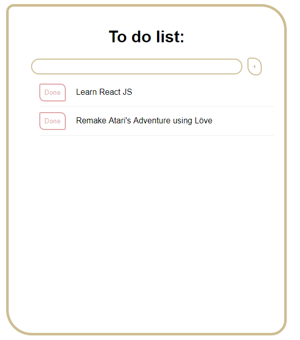

Credits to [Brice Ayres video](https://www.youtube.com/watch?v=XCCW2y4wXNg) introducing this to-do list logic. [Link to his original repo here](https://github.com/MyNameIsURL/react-todo-app).

This project was made for both JS and React studies, it's a simple application to add and remove tasks using inputs and events, giving some basic improvements (like adding tasks by pressing the enter key) to learn more about it.

